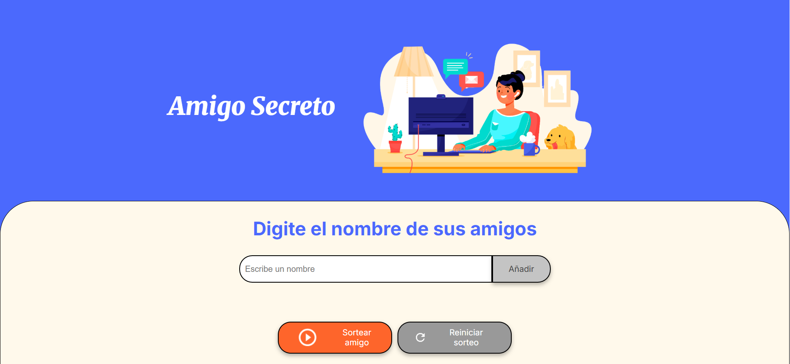

# 🎁 Challenge ONE Lógica de Programación - Amigo secreto
Proyecto realizado como parte del programa **#OracleNextEducation** del grupo 9 (**#helloONEG9**), en colaboración con [@Oracle](https://twitter.com/Oracle) y [@AluraLatam](https://twitter.com/AluraLatam).

## 🎯 Objetivo

Este proyecto permite a los usuarios agregar nombres de amigos y realizar un sorteo aleatorio para seleccionar un "amigo secreto".  
Fue desarrollado para poner en práctica conceptos clave de programación como variables, condicionales, funciones, arrays y lazos de repetición

---
## 🚀 Funcionalidades

- ✅ Agregar nombres de participantes.
- ✅ Validación para evitar duplicados o campos vacíos.
- ✅ Sorteo aleatorio de parejas sin repeticiones.
- ✅ Visualización del resultado en pantalla.
- ✅ Reinicio del sorteo para volver a comenzar.
- ✅ Diseño responsivo adaptado a móviles y pantallas pequeñas.
---

## 🛠️ Tecnologías utilizadas

- **HTML5**
- **CSS3**
- **JavaScript**
---

## 📸 Vista previa

---

## 🔗 Acceso al proyecto

👉 [Haz clic aquí para ver el proyecto en línea](https://mbarbaran.github.io/challenge-amigo-secreto_esp-main/)

---

**#OracleNextEducation** | **#helloONEG9**  
[@Oracle](https://www.instagram.com/oraclelatinoamerica/#) | [@AluraLatam](https://www.instagram.com/aluralatam/).

